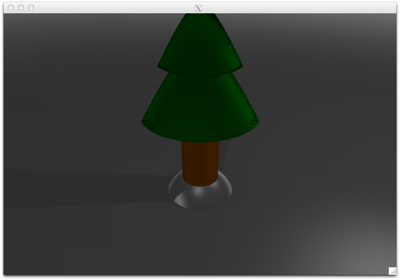

# C++ Ray Tracer
Non-recursive ray tracing renderer written entirely in C++. The program reads an input text file describing the placement of a camera, lights, and generic shapes within a scene. The generic shapes can be modified by a transformation matrix to achieve a greater variety of shapes. The program then opens a window on the host system displaying the rendered scene.

## Example Input: Lonely Tree On Christmas Day

An example input file with resulting output can be found in the "example_input" folder.

Using lonely_tree.txt as a base, the input file format is described in detail below:
```c
/* Camera Parameters */
Ex 10.0
Ey 10.0 // Camera origin in world coordinates
Ez 12.0
------------
Gx 0.0
Gy 0.0 // Camera gaze point in world coordinates
Gz 3.0
------------
UPx 0.0
UPy 0.0 // Upward direction vector
UPz -1.0
------------
N 5.0 // Distance from the near plane
F 25.0 // Distance from the far plane
------------
THETA 45.0 // Viewing angle of the camera
HEIGHT 512 // Height of the projected image (i.e. window height)
ASPECT 1.5 // Aspect ratio of the projected image (1 for equal width & height)

/* Light Sources */
Lx 10.0
Ly -10.0 // 1st point light coordinates
Lz 10.0
------------
Lx 40.0
Ly 60.0 // 2nd point light coordinates
Lz 40.0
------------
.
. // More point lights can be inserted here
.
------------
SUN 0 // Global light flag (0 = false, 1 = true)

/* Scene Shapes */
l // Generic shape type (l = cylinder, s = sphere, p = plane, c = cone)
102 51 0 // Shape colour (RGB values)
0.6 0.3 0.1 // Ambient, diffuse, and specular coefficients
1 0 0 0 // Transformation matrix
0 1 0 0
0 0 5 0
0 0 0 1
------------
s
255 255 255
0.4 0.1 0.5
2 0 0 0
0 2 0 0
0 0 2 -0.8
0 0 0 1
------------
p
255 255 255
0.4 0.1 0.5
1 0 0 0
0 1 0 0
0 0 1 0
0 0 0 1
------------
c
0 153 0
0.4 0.3 0.3
3 0 0 0
0 3 0 0
0 0 3 8
0 0 0 1
------------
c
0 153 0
0.4 0.3 0.3
2 0 0 0
0 2 0 0
0 0 2 9.5
0 0 0 1
------------
.
. // More shapes can be inserted here
.
------------
```
The resulting output:



## Known Bugs

Certain shadowed pixels will sometimes render as entirely black.
